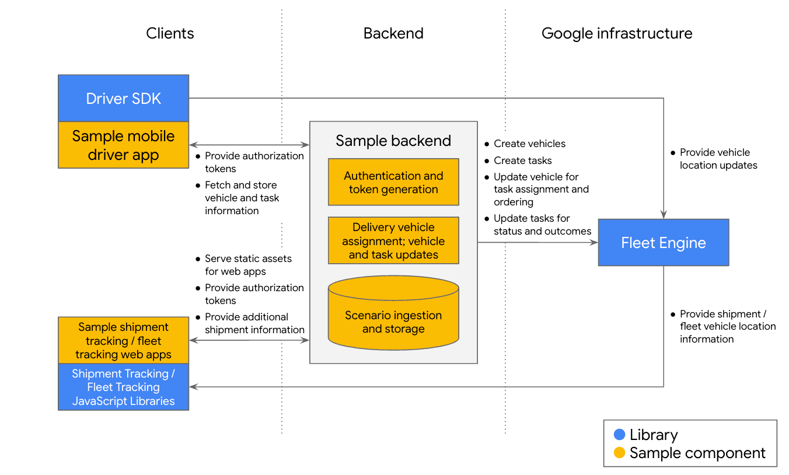

# Last Mile Fleet Solution Sample Apps

## Introduction

The LMFS Sample Apps provide reference implementations of the various
integrations and applications that use the
[LMFS APIs](https://developers.google.com/maps/documentation/transportation-logistics/last-mile-fleet-solution).
You can use these samples to quickly bootstrap a solution to create, update, and
simulate vehicles, journeys and tasks. These apps work for both mobile and web.

To get started, use the [getting started guide](getting-started.md).

## Components

There are three main pieces to the sample applications:

1.  The backend, a Java-based server using the Fleet Engine API, which supports
    services for the mobile applications as well as web-facing applications.

    The backend is contained in the `backend/` directory.

1.  Mobile driver apps:

    -   The Android Driver app, an Android client for delivery drivers written
        in Java using the Driver, Navigation, and Maps SDKs, which can be run on
        Android devices or simulators.

        The Android Driver app is contained in the `android_driverapp_samples`
        directory.

    -   The iOS Driver app, an iOS client for delivery drivers written in Swift
        using the Driver, Navigation, and Maps SDKs, which can be compiled and
        run on iOS devices or simulators.

        The iOS Driver app is contained in the `ios_driverapp_samples`
        directory.

1.  Web apps:

    -   The Shipment Tracking web app for users to track the progress of their
        shipments.
    -   The Fleet Tracking web app used by operators to track delivery vehicles.

    The sample web apps are located in the `backend/src/main/webapp/html`
    directory, but can be hosted on any web server that can serve static HTML,
    CSS and JavaScript assets. These apps use the JavaScript Shipment Tracking
    and Fleet Tracking libraries.

In addition, some tools are shipped to help with the deployment and
instantiation of a sample apps instance:

-   `update_configuration.sh`: this script is used during deployment to set up
    credentials for the whole project.
-   `generator`: this is a utility that creates scenario files that can be used
    to simulate delivery scenarios. For more information, consult the utility's
    [README](tools/generator/README.md).

## System architecture



### Backend

For a detailed listing of the web pages and endpoints, refer to
[the backend README file](backend/README.md).

#### Authentication and token generation

The authentication component communicates with the Cloud Project for a LMFS
deployment, generates JSON Web Tokens (JWTs) of various kinds, and passes the
tokens onto the other apps to facilitate their communication with Fleet Engine.

This component makes use of the
[Fleet Engine Auth Library for Java](https://github.com/googlemaps/java-fleetengine-auth),
and requires that the the development host has been set up for Google Cloud
authentication, and that the Google Cloud project used for Fleet Engine access
has created service accounts used to sign these tokens.

For detailed setup procedure, refer to the
[getting started guide](getting-started.md).

#### Scenario ingestion

The scenario ingestion component allows the user to upload a delivery
configuration file, which contains definitions for delivery vehicles, stops, and
tasks to be performed at each stop. A task can be a pick-up or delivery of a
package. Upon receiving such a file, the component calls Fleet Engine to create
these vehicles, stops, and tasks. Uploading the delivery configuration file also
triggers the creation of "Manifest" configs for each vehicle in the file.
These Manifests are a sample backend implementation and not a requirement for
LMFS itself. Restarting the backend removes the existing Manifests because they
exist only in RAM.


#### Delivery vehicle assignment

When a mobile driver app requests a vehicle assignment, the backend associates
one of the defined (and available) delivery vehicles to the requester, and sends
the information to the app. The app uses the information to set up its internal
representations of these entities, and allows for simulation of a delivery
vehicle as it travels through its assigned stops and performs its assigned
tasks. This means that your app's configured vehicle ID may not match the
assigned vehicle ID.

#### Vehicle and task updates

The backend exposes endpoints that allow the mobile driver app to request
vehicle and task updates. These updates allow the mobile driver app to indicate,
for example, that a task has been completed, that the vehicle is en route to its
next stop, or that the driver has requested the stops to be re-sequenced.

#### Web pages and app serving

The backend serves the static resources for the shipment tracking and fleet
tracking web apps: HTML, CSS and JavaScript. In addition, the backend has
endpoints through which the web apps can obtain information about the tasks and
vehicles that they are tracking.

### Mobile driver app

The mobile driver app communicates with the backend, obtains a manifest of stop
and task definitions, and shows the data in a user interface that allows the
driver to perform the following actions:

-   Check the tasks to be performed at each stop.
-   Manually resequence the stops to change the order in which they are to be
    visited, if needed.
-   Initiate navigation to the first stop on the list.
-   Automatically send location updates to Fleet Engine.
-   Mark tasks as complete.

For details on the setup and usage of the mobile app, refer to the
[Android](android_driverapp_samples/README.md) and
[iOS](ios_driverapp_samples/README.md) mobile driver app README files.

### Web apps

The web apps communicate with the backend and Fleet Engine to retrieve status
updates for a task or delivery vehicle. The apps then visualize the movement of
the tracked entity in an automatically updated map and present data such as ETA
in a tabular format. The web apps are designed for end users (such as package
recipients) and delivery company dispatch operators.

The web apps integrate with the JavaScript Shipment Tracking and Fleet Tracking
SDKs.

For details on the usage of the web apps, refer to the [web apps](web-apps.md)
document.

## Delivery configuration file

The delivery configuration file specifies the list of vehicles, their manifests
(consisting of a list of stops and tasks), and the order in which the stops are
to be traversed. The
[file format](backend/README.md#delivery-configuration-file) is designed to be
human-readable and easy to adapt to existing scheduling formats.

### Command-line utility for generating a delivery configuration

This utility, written in Python, generates a delivery configuration file with
stops and tasks scattered in a region. For details on the utility, refer to
[the generator's README file](tools/generator/README.md).

## License

```
Copyright 2022 Google LLC.

Licensed to the Apache Software Foundation (ASF) under one or more contributor
license agreements.  See the NOTICE file distributed with this work for
additional information regarding copyright ownership.  The ASF licenses this
file to you under the Apache License, Version 2.0 (the "License"); you may not
use this file except in compliance with the License.  You may obtain a copy of
the License at

  http://www.apache.org/licenses/LICENSE-2.0

Unless required by applicable law or agreed to in writing, software
distributed under the License is distributed on an "AS IS" BASIS, WITHOUT
WARRANTIES OR CONDITIONS OF ANY KIND, either express or implied.  See the
License for the specific language governing permissions and limitations under
the License.
```
