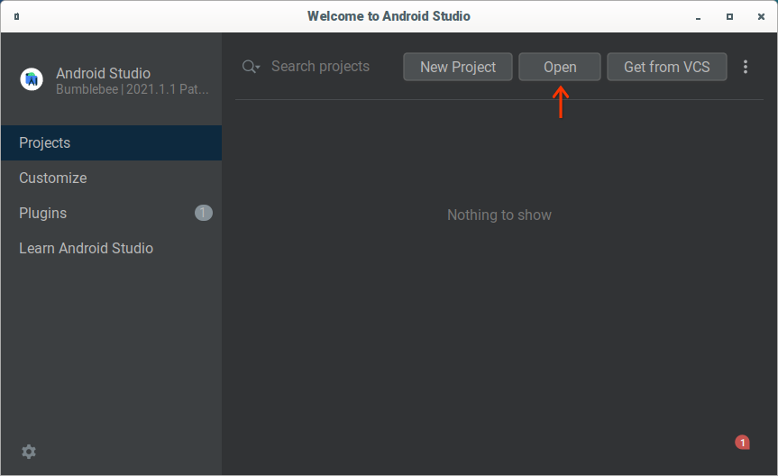
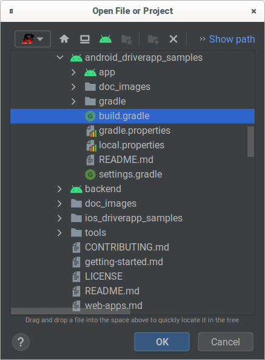
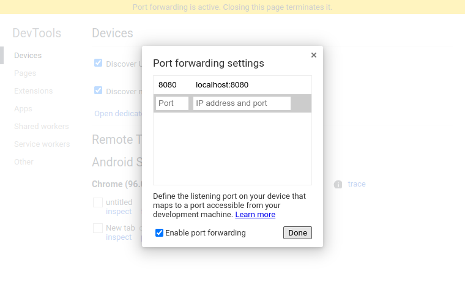
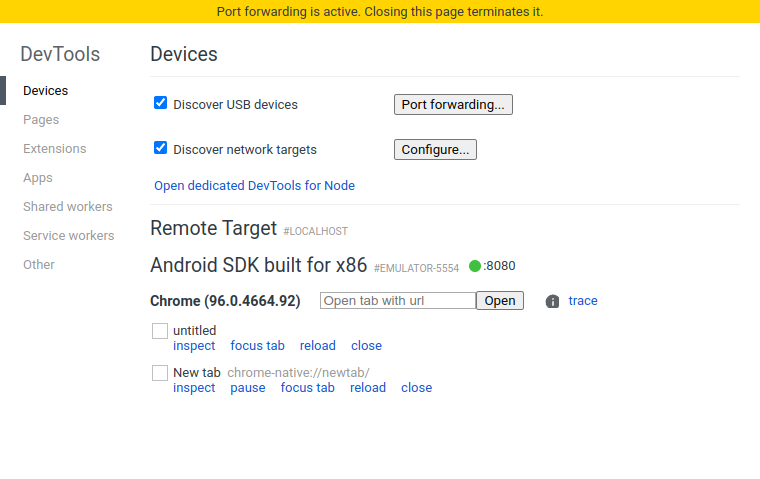
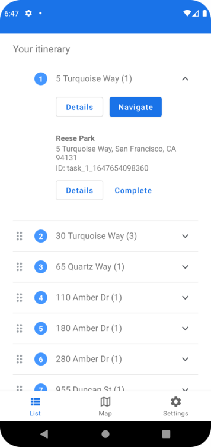
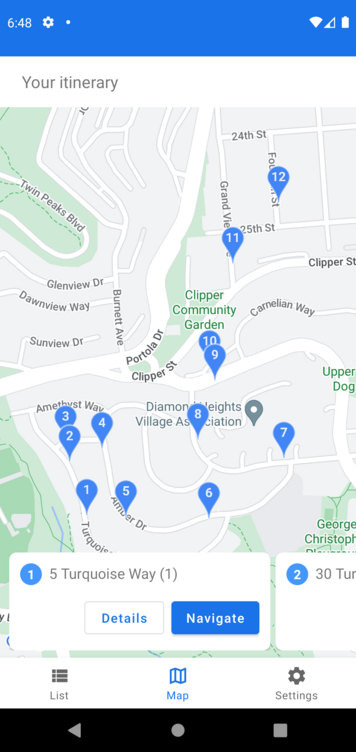
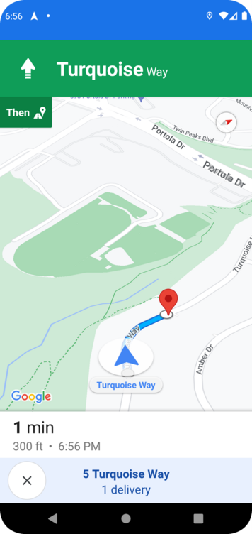

# Sample Delivery Driver App for Android

## Overview

This is an Android sample app for demonstrating Fleet Engine LMFS APIs and
communication with a sample backend. Use this in conjunction with the backend
server and sample web apps to demonstrate full functionality.

The sample driver app uses the following Google Maps Platform SDKs:

-   [Driver SDK](https://developers.google.com/maps/documentation/transportation-logistics/last-mile-fleet-solution/shipment-tracking/driver-sdk/driver_sdk_quickstart_android)
-   [Navigation SDK](https://developers.google.com/maps/documentation/navigation-sdk-android/v2)
-   [Maps SDK](https://developers.google.com/maps/documentation/android-sdk/overview)

In addition, the sample driver app also implements authentication token fetching
from the backend.

## Prerequisites

This document assumes you have the following software set up on your
workstation:

-   Java SDK 17 (support for newer SDKs is work in progress)
-   Android Studio (latest version)
-   Android SDK (latest updates)
-   Gradle 8 (latest version)

You also need to
[get access to the Driver SDK for Android](https://developers.google.com/maps/documentation/transportation-logistics/last-mile-fleet-solution/shipment-tracking/driver-sdk/driver_sdk_quickstart_android#get_access).

## Setup

### Step 1. Import Android driver app

1.  Start Android Studio. Select *Open*:

    

1.  Select the `build.gradle` file in the `android_driverapp_samples/` directory:

    

1.  Importing the project takes a few minutes. When that is complete, you should
    be able to run your project.

### Step 2. Port forwarding

If using a virtual device in Android Emulator, you need to set up port
forwarding. Make sure that your virtual device and your workstation have Chrome
installed.

1.  Launch Chrome on the Android device.

1.  *On the workstation*, launch Chrome and navigate to
    <chrome://inspect#devices>.

1.  You should see the device in the "Remote Target" section. If not, the driver
    app cannot communicate with the backend.

1.  Click on the "Port Forwarding" button and set up a port forwarding rule for
    port 8080. Ensure the "Enable port forwarding" checkbox is selected, then
    click "Done".

    

1.  You should see the following after setting up port forwarding. A green
    circle with ":8080" next to the Android SDK section means the port
    forwarding was successful.

    

During the deployment, if the Android driver app reports that it cannot fetch a
manifest or communicate with the backend, make sure that Chrome is running on
both the Android device and the workstation, and that the port forwarding rule
is active.

### Step 3. Launch the app

Before executing the steps in this section, ensure the backend is running, and a
delivery configuration file has already been loaded. For details, see the
getting started documentation on
[starting the backend host](../getting-started.md#start-the-backend-host) and
[loading the delivery configuration](../getting-started.md#load-the-delivery-configuration).

1.  From Android Studio, select "Run > Run 'app'". The app should start after it
    is built.

1.  The first time the app is launched, click the "Settings" tab and update the
    settings:

    -   Backend URL: verify that this is the host of your backend, and that the
        port number matches the port forwarding rule you've created. If you
        started the backend server via the instructions in
        [Getting Started](../getting-started.md#start-the-backend-host), the
        backend URL is `http://localhost:8080`.
    -   Client ID: this is a unique identifier for your app, and is randomly
        generated upon app install. You can set an identifier of your choice.

    Then re-launch the app from Android Studio.

1.  The app should now be able to fetch the manifest from the backend.

## The app interface

The app has four main views: a list view, a map view, and a navigation view, and
a settings view. The list view is presented by default.

### List view

The list view shows a list of stops in the order they should be traversed. Each
stop contains a number of tasks that should be performed at that location.
Expanding the list of tasks at a stop allows you to mark each task as
successful, or open a details view that shows more information about the stop or
its tasks. Drag the handle on the left of each stop to resequence the stops.

### Map view

The map view shows the same information as the list view, except with a map
listing the stops. You cannot re-sequence the stops in the map view.

### Navigation view

You can enter the navigation view from either the list view or the map view, and
only if the sequence of stops contains incomplete tasks. When entering the
navigation view, you must navigate to the next pending stop in the sequence.
The navigation view resembles a Google Maps navigation session; at the
bottom of the view, there is a description of the address, the number of pickup
or dropoff tasks, and a button to exit the navigation view.

### Settings view

You can change various settings in the Settings view.

## Using the app

Upon launch, the app contacts the backend and retrieves a manifest assignment
containing stops and tasks. A typical workflow for the app consists of the
following:

1.  The driver opens the app to receive a manifest assignment.

1.  Optionally, the driver may resequence the stops to change the order in which
    they are served, in order to fulfill requirements such as
    time-of-day-sensitive deliveries. For additional route optimization
    capabilities for LMFS, see the
    [developer documentation](https://developers.google.com/maps/documentation/transportation-logistics/last-mile-fleet-solution/route-optimization-overview).

1.  The driver starts to navigate to the first stop.

1.  The driver arrives at the stop, exits the vehicle, and starts performing
    each task at that stop. For example, the stop may be located at an apartment
    building. The driver may need to deliver packages to three different
    residences inside the building, and pick up a package from another
    residence. After each task is completed, the driver presses the "Completed"
    button to mark the task as complete.

    When all tasks at a stop are completed, the stop is marked as complete via a
    green checkmark.

1.  The driver repeats steps 3 and 4 for each remaining stop until all stops
    have been visited and all tasks have been performed at each stop.

### Simulating vehicle movement

The sample driver app simulates vehicle movement via the
[simulator](https://developers.google.com/maps/documentation/navigation-sdk-android/v2/reference/com/google/android/libraries/navigation/Simulator?hl=en)
in the Navigation SDK. The simulator may be enabled or disabled via a toggle
switch in the Settings view.

By default, the simulator is set to move the vehicle at 5x the speed limit of
the road it's travelling on, in order to speed up testing. This multiplier can
be changed in `NavigationView.java` via
[`speedMultiplier`](https://developers.google.com/maps/documentation/navigation-sdk-android/v2/reference/com/google/android/libraries/navigation/SimulationOptions?hl=en#public-simulationoptions-speedmultiplier-float-speedmultiplier).

### Disabling location updates

Location updates may be enabled or disabled via the toggle switch in the
Settings view. When location updates are disabled, locations will not be sent to
Fleet Engine.

## Common issues

-   The app reports "cannot connect to the backend".

    Ensure Chrome is running on *both* the Android device and the
    workstation, and the port forwarding rule is set up and operational.

-   The app reports 404 when fetching the manifest from Android.

    Ensure that the backend has loaded a delivery configuration, and that a
    manifest is available (unassigned) for the app.

-   The app does not load the map, or does not start navigation.

    Ensure that there is a valid API key specified in
    `src/main/AndroidManifest.xml`. The key must be able to access the
    Navigation and Maps SDK for Android. Setting a valid key is part of the
    `upload-configuration.sh` step in the
    [Getting Started guide](../getting-started.md).
