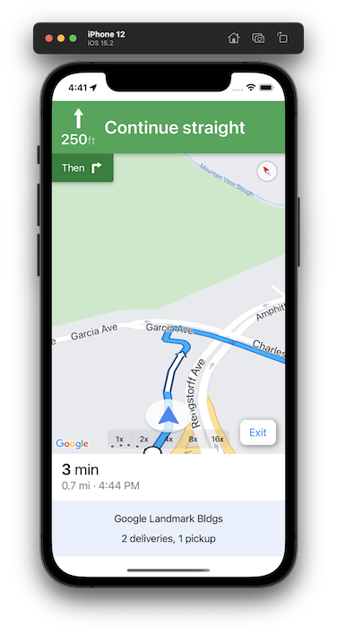

# Sample Delivery Driver App for iOS

<!-- This is an iOS-specific file. -->

## Overview

This iOS sample app demonstrates how the Fleet Engine LMFS APIs communicate with
a sample backend. It's not intended as a standalone sample. Instead, use this
sample in conjunction with the backend server and sample web apps provided in
this repository.

The sample driver app uses the following Google Maps Platform SDKs:

-   [Driver SDK](https://developers.google.com/maps/documentation/transportation-logistics/last-mile-fleet-solution/shipment-tracking/driver-sdk/driver_sdk_quickstart_ios)
-   [Navigation SDK](https://developers.google.com/maps/documentation/navigation-sdk-ios)
-   [Maps SDK](https://developers.google.com/maps/documentation/ios-sdk)

In addition, the sample driver app also implements authentication token fetching
from the backend.

## Prerequisites

This document assumes you have the following software set up on your
workstation. Ensure these are installed before proceeding.

-   Java SDK 17 (support for newer SDKs is work in progress)
-   Gradle 8 (latest version)
-   Xcode (13.2.1 or newer)
-   Cocoapods
-   The `gcloud` command line utility for Google Cloud
    ([instructions](https://cloud.google.com/sdk/docs/install))

You also need to
[get access to the Driver SDK for iOS](https://developers.google.com/maps/documentation/transportation-logistics/last-mile-fleet-solution/shipment-tracking/driver-sdk/driver_sdk_quickstart_ios#get_access).

## Setup

Once you met all prerequisites above, follow these steps for setup.

### Step 1. Build and run the backend

If you haven't already done so, configure, build, and start the backend and load
a configuration file. See the getting started documentation on
[starting the backend host](../getting-started.md#start-the-backend-host) and
[loading the delivery configuration](../getting-started.md#load-the-delivery-configuration).

### Step 2. Open the Xcode workspace

1.  Open a terminal and go to the directory containing the Podfile:

    ```shell
    cd <path-to-project>
    ```

1.  Run the `pod install` command. This installs the pods specified in the
    Podfile, along with any dependencies they may have.

    ```shell
    pod install
    ```

1.  Open the modified Xcode workspace.

    ```shell
    open LMFSDriverSampleApp.xcworkspace
    ```

    As with other Cocoapods projects, be sure to always use the `.xcworkspace`
    file, not the `.xcproject` file, to work on the app.

### Step 3. Launch the app

1.  From Xcode, select "Product > Run". The app should start after it is built.

1.  The app should now be able to fetch the manifest from the backend. If you
    don't see tasks in the default List view, see Troubleshooting below.

## The app interface

The app has four main views: a list view, a map view, and a navigation view, and
a settings view. The list view is presented by default.

### List view


The list view shows a list of stops in the order they should be traversed; each
stop is typically displayed as the address.

Expanding the stop shows two actions that can be taken:

-   seeing a detailed view of the stop
-   navigating to the stop

Expanding the stop also shows the list of tasks to be performed at that stop.
For each task, the user can perform the following actions:

-   mark the task as successfully completed
-   mark that the task could not be completed

The disclosure arrow shows a detailed view of the map around the task's
location.

To reorder the stops, press the **Reorder stops** button. Handles will appear
so you can reorder the remaining stops.

**HINT:** The reorder user interface is easier to use if the stops are not
    expanded.

If the app has successfully loaded a manifest, the vehicle ID is displayed
at the bottom of the screen. There is a **Copy** button at the right side of the
screen.  You can use this to copy the same vehicle to see it on the Web App
version of this sample.

### Map view


The map view shows the same information as the list view, except as a map that
displays the stops using waypoint markers along the highlighted route.

### Navigation view



You can enter the navigation view from either the list view or the map view by
navigating to the first stop with uncompleted tasks. The navigation view
resembles a Google Maps navigation session; at the bottom of the view, there is
a description of the address, the number of pickup or dropoff tasks, and a
button to exit the navigation view.

#### Simulating vehicle movement

The sample driver app simulates vehicle movement via the
[simulator](https://developers.google.com/maps/documentation/navigation-sdk-ios/reference/interface_g_m_s_location_simulator)
in the Navigation SDK. You can enable or disable the simulator using a toggle
switch in the Settings view.

You can change the speed at which the simulated vehicle moves in the HUD that
appears in the navigation view.

### Settings view

The settings view contains a number of sections that may be helpful depending
on the configuration of the host where the application is running. A brief
explanation of each section follows.

#### Vehicle ID

The first section concerns the ID of the loaded vehicle. The current ID is
displayed if a vehicle is loaded. If a vehicle is not loaded, you can request
the next available vehicle from the backend (this is typically done
automatically at startup). You can use an arbitrary ID to load a known vehicle.

#### Backend App URL

The backend app URL can be set here if the backend is not running at the default
location of http://localhost:8080/. See Troubleshooting below.

#### Navigation

Location simulation and location reporting during navigation can be enabled or
disabled.

#### Token

When the app starts up, it attempts to fetch a
[JSON Web Token for authorization](https://developers.google.com/maps/documentation/transportation-logistics/last-mile-fleet-solution/shipment-tracking/fleet-engine/auth?hl=en#creating_a_json_web_token_jwt_for_authorization)
from the backend.

This section displays the status of the most recent fetch attempt. If the
attempt was successful, you can copy the fetched token using the copy button.
If the fetch attempt was not successful, you can attempt the fetch again.

#### Status

This section displays the number of update attempts for the following:
-   vehicle location updates to Fleet Engine
-   task status updates to the backend
-   stop status updates to the backend

## Using the app

Upon launch, the app contacts the backend and retrieves a manifest assignment
containing stops and tasks. A typical workflow for the app consists of the
following:

1.  The driver opens the app to receive a manifest assignment.

1.  Optionally, the driver may resequence the stops to change the order in which
    they are served, in order to fulfill requirements such as
    time-of-day-sensitive deliveries, or to avoid traffic.

1.  The driver starts to navigate to the first stop.

1.  The driver arrives at the stop, exits the vehicle, and starts performing
    each task at that stop. For example, the stop may be located at an apartment
    building. The driver may need to deliver packages to three different
    residences inside the building, and pick up a package from another
    residence. After each task is completed, the driver presses the "Completed"
    button to mark the task as complete.

    When the driver marks all tasks at a stop as complete, the stop is shown as
    complete via a green checkmark.

1.  The driver repeats steps 3 and 4 for each remaining stop until until they
    visit all stops and perform all tasks at each stop.

## Common issues

-   The app reports "cannot connect to the backend."

    -   Make sure the backend is running.

    -   Verify the host and port for connecting to the backend

        If you were not able to run the backend on `http://localhost:8080/`,
        you'll need to provide an alternate URL for the backend.

        -   Go to the Settings screen.

        -   Enter the correct URL into the box under "Backend app URL."

        -   Tap the "Test" button.

            -   If you see "verified" below the button, the app is able to
                contact the backend; continue.
            -   If you see a failure message, the backend could not be
                contacted. You may have some sort of network connectivity or
                firewall problem that prevents the two processes from
                communicating.

-   The app does not show any stops.

    -   Verify the backend has a manifest loaded.

    -   If you're sure the backend is set up correctly, see the "Verify the host
        and port for connecting to the backend" instructions above.

-   The app does not load the map, or does not start navigation.

    -   Ensure that there is a valid API key specified in
        `LocalOverrides/ApplicationDefaults.json`.

    -   You can use the debugger to verify the app is able to correctly access
        your key; see `googleMapsInited` property in the class
        `LMFSDriverSampleApp`.

## License

```
Copyright 2022 Google LLC.

Licensed to the Apache Software Foundation (ASF) under one or more contributor
license agreements.  See the NOTICE file distributed with this work for
additional information regarding copyright ownership.  The ASF licenses this
file to you under the Apache License, Version 2.0 (the "License"); you may not
use this file except in compliance with the License.  You may obtain a copy of
the License at

  http://www.apache.org/licenses/LICENSE-2.0

Unless required by applicable law or agreed to in writing, software
distributed under the License is distributed on an "AS IS" BASIS, WITHOUT
WARRANTIES OR CONDITIONS OF ANY KIND, either express or implied.  See the
License for the specific language governing permissions and limitations under
the License.
```
