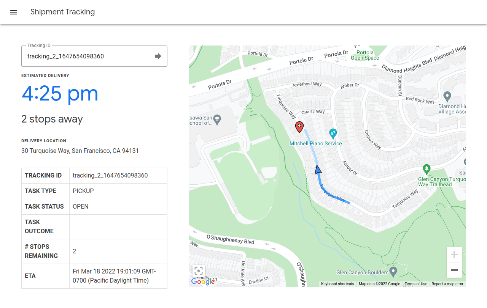
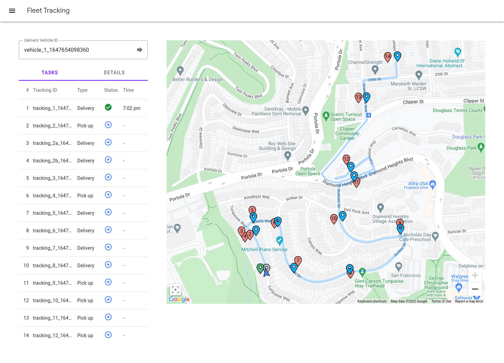

# LMFS Sample Web Apps

## Introduction

The sample web apps are reference integrations with the JavaScript [Shipment
Tracking](https://developers.google.com/maps/documentation/transportation-logistics/last-mile-fleet-solution/shipment-tracking/how-to/track_shipment) and [Fleet Tracking](https://developers.google.com/maps/documentation/transportation-logistics/last-mile-fleet-solution/fleet-performance/how-to/track_fleet) libraries. They allow users to track the status of a particular shipment or
fleet.

In addition to the shipment tracking and single-vehicle fleet tracking 
capabilities shown by the sample web apps here, you can also monitor the state
of the entire fleet. For details, see
[Viewing a delivery fleet](https://developers.google.com/maps/documentation/transportation-logistics/last-mile-fleet-solution/fleet-performance/how-to/track_fleet#viewing_a_delivery_fleet)
in the developer documentation.

## Set up

The sample web apps do not require configuration. After the backend is
successfully [deployed](getting-started.md#start-the-backend-host), you can open
the pages containing the sample apps. The rest of this document assumes you have
deployed your backend on your workstation at port 8080. Modify the URLs as
appropriate for your own deployment.

You can find the HTML, CSS and JavaScript assets for the sample web apps in the
`backend/src/main/webapp/html` directory.

## Usage

### Shipment tracking

You can access the shipment tracking web app at
<localhost:8080/shipment_tracking.html>.

The shipment tracking web app needs a tracking ID in order to operate successfully.
You can find the tracking ID of a particular task in
the web page that is generated after you have uploaded a delivery configuration.
It will look like `tracking_1_1646642081740`. Note that the timestamp
(`1646642081740` in the above example) must be included in the tracking ID. For
details about how to upload a configuration, see the
[getting started guide](getting-started.md#load-delivery-configuration).

After entering the tracking ID, the UI shows the current location of the
delivery vehicle, how many other stops it needs to make before performing the
tracked task, the estimated time of completion, and other information. The
delivery vehicle icon on the map moves along the route as its location is
updated from the sample driver app. When the driver app marks the task as
complete, the task will also be marked complete in the web app.

### Fleet tracking

You can access the fleet tracking web app at
<localhost:8080/fleet_tracking.html>.

In order for the fleet tracking web app to operate successfully, you need to
supply a delivery vehicle ID. You can find the delivery vehicle ID of a
particular vehicle in the webpage generated after you have uploaded a delivery
configuration. It will look like `vehicle_1_1646642081740`, and can be found as
the final part of the `name` of the delivery vehicle. The full name of the
delivery vehicle will look like
`providers/<provider-id>/deliveryVehicles/vehicle_1_1646642081740`. Note that
the timestamp (`1646642081740` in the above example) must be included in the
delivery vehicle ID.

After entering the delivery vehicle ID, the UI shows the current location of the
delivery vehicle, its remaining route, stops along the way, and tasks to be
performed at each stop. The tasks are numbered and match the list of tasks on
the left. Click on a task to bring up an information window about the task.

## Common issues

-   The map does not load.

    The sample web apps require the use of Google Cloud API keys that are
    enabled for the Google Maps JavaScript API.

    Verify that there is a correct key in
    `backend/src/main/resources/config.properties` under `api-key`. Entering
    the correct key is part of the `upload-configuration.sh` step in the
    [Getting Started guide](getting-started.md).

-   The location provider reports a 403 from Fleet Engine.

    The sample web apps communicate with Fleet Engine via authentication tokens.
    These tokens are generated by the backend via the use of service accounts
    with particular roles in your Cloud project.

    In `backend/src/main/resources/config.properties`, verify that there is a
    valid service account email address for `consumer-service-account-email`.
    Entering the correct service account email address is part of the
    `upload-configuration.sh` step in the
    [Getting Started guide](getting-started.md).

    In Google Cloud Console, verify that this service account has the roles
    "Service Account Token Creator" and "Fleet Engine Delivery Consumer User".
